LmRaC (Language Model Research Assistant & Collaborator) is an LLM-based web application that enables users to explore, understand and interrogate their own biological experiments by:

-   incrementally building custom knowledge bases from the scientific literature, and

-   using custom functions to make quantitative data available to the language model.

LmRaC uses a multi-tier retrieval-augmented generation (RAG) design to index: domain knowledge, experimental context and experimental results. LmRaC is fully data-aware through the use of a user-defined REST API that allows the LLM to ask questions about data and results.

------------------------------------------------------------------------

## Table of Contents

> ### Getting Started
> 
> * [Prerequisites](#Prerequisites)
> * [Quick Start](#Quick-Start)
> * [Installation](#Installation)

> ### Application Windows & Configuration
> 
> * [LmRaC Homepage](#LmRaC-Homepage)
> * [Indexes](#Indexes)
> * [Experiments](#Experiments)
> * [Functions](#Functions)
> * [Answers](#Answers)
> * [Configuration](#Configuration)

> ### Usage, Workflow & Troubleshooting
> 
> * [Usage: Q & A](#Usage---Q-and-A)
> * [Usage: Experiments](#Usage---Experiments)
> * [Usage: User-Defined Functions](#Usage---User-Defined-Functions)
> * [Indexes and Experiments and Functions](#Indexes-and-Experiments-and-Functions)
> * [Troubleshooting](#Troubleshooting)

> ### Credits
> 
> * [How To Cite](#How-To-Cite)
> * [Contact](#Contact)

------------------------------------------------------------------------

## Prerequisites

### Docker

LmRaC runs as a web application in a Docker container. Users must therefore have either [Docker Engine](https://docs.docker.com/engine/install/) (CLI) or [Docker Desktop](https://docs.docker.com/desktop/install/linux-install/) (GUI) installed. If running Docker in the cloud, we recommend a container optimized OS. See [Installation](#Installation) below for details on installing Docker.

### OpenAI

LmRaC uses OpenAI's GPT-4o API to perform many language related functions. GPT does not per se answer user questions. Instead, it is used to assess the usefulness of primary source material for answering questions. Users of LmRaC must have an active OpenAI API account with an API key (see [Project API keys](https://platform.openai.com/api-keys)). Once a key has been created, it must be passed into the Docker container. This is typically done by creating an environment variable and then passing a reference to this variable in the **docker run** command using the **-e** option.

```         
export OPENAI_API_KEY="sk-asdlfjlALJWEasdfLWERLWwwSFSSEwwwww"
```

### Pinecone

[Pinecone](https://app.pinecone.io/) is a vector database used by LmRaC to store and search vector embedding of source material. Users must have an active Pinecone account then [create a Serverless API Key](https://docs.pinecone.io/guides/projects/understanding-projects#api-keys) from the Pinecone console. Once a key has been created, it must be passed into the Docker container. This is typically done by creating an environment variable and then passing a reference to this variable in the **docker run** command using the **-e** option.

```         
export PINECONE_API_KEY="2368ff63-8a81-43e3-9fd5-46e892b9d1b3"
```

------------------------------------------------------------------------

## Quick Start

Pull the latest tagged image from Docker Hub. Run LmRaC using Docker Engine (if Docker is not installed or you're using Docker Desktop, see the [Installation](#Installation) instructions below). You'll need to pass API keys for OpenAI and Pinecone and mount your local directory (e.g., \$PWD) to the LmRaC /app/user directory. The local directory is where user experiments are found and to where all LmRaC logs and output will be written.

```         
docker pull dbcraig/lmrac:latest
cd <your-lmrac-root>
docker run -m1024m -it -e OPENAI_API_KEY=${OPENAI_API_KEY} -e PINECONE_API_KEY=${PINECONE_API_KEY} -v $(pwd)/work:/app/user -v /etc/localtime:etc/localtime:ro -p 5000:5000 dbcraig/lmrac
```

Open LmRaC in your browser: <http://localhost:5000> Typically, the port is 5000, but depending on your Docker configuration and what else is running on your host, this may be different (e.g., 55001 for Docker Desktop).

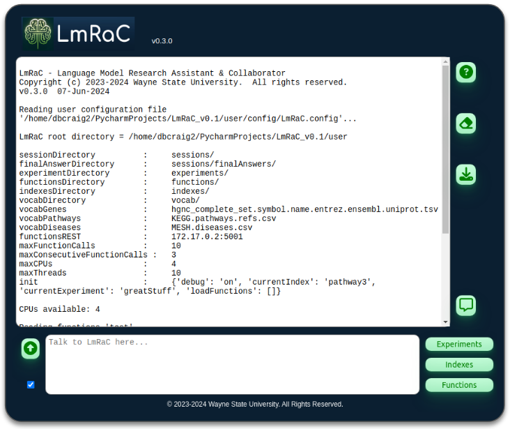

LmRaC will initialize and report any problems. The first time you run LmRaC will use a default configuration. See [Configuration](#Configuration) below for how to customize the configuration. When you quit LmRaC your current configuration is saved to LmRaC.config in the the mounted config/ folder.

### Creating an Index

All questions are answered relative to a index of source material. So, set an index in Pinecone to store embeddings of the sources. If the index does not exist, you'll be asked to create it. LmRaC will indicate how many paragraphs of information are currently stored in the index. Note: the command to set the index is in natural language, so you can ask something like: "Set index to test1" or "index = test1" or anything that indicates you want to set the index.

```         
[user]  set index to test1
[LmRaC] The current index has been set to 'test1'.
Index sizes are:
RAGdom : test1 (28810) 
RAGexp : test1-exp (123) 
```

Each index has two parts: 

- **RAGdom** the general domain knowledge index for primary material (e.g., PubMed articles)
- **RAGexp** the experiment specific index for secondary material (e.g., saved answers, protocols, background/context knowledge)

### Asking questions and populating your Index

Ask a question. LmRaC will analyze the question for any mention of genes, diseases or pathways. It will summarize what it finds as the Search Context. If the index already contains information about any of these items, you will be given the option of updating the index (i.e., searching for more documents). If the index does not include information about one or more item in the question, it will initiate a search of PubMed.

```         
[LmRaC] How can I help you? \>\> what is tp53? How detailed an answer would you like (1-7)?

## Question

'what is tp53' Answer complexity: 1 Analyzing question to determine genes, pathways and diseases...

## Search Context

Genes : ['TP53'] Pathways : hsa04115 : p53 signaling pathway References (curated): [16557269, 15838523, 11747320, 11313928, 15116721, 12505356, 10714958, 16697662, 16915296, 17409411, 26037915, 19584092, 19240372, 12135761] Diseases :

## PubMed Search : Genes

### Gene TP53

References exist for gene 'TP53'. Skip download from PubMed? [Y/n]

## PubMed Search : Pathways

### Pathway hsa04115 : p53 signaling pathway

References exist for pathway 'p53 signaling pathway'. Skip download from PubMed? [Y/n]
```

### Viewing Answers

Answers are displayed during processing and saved in the sessions/finalAnswers/ directory along with information about the original query, generated sub-queries, references for the answer and a GPT4 assessment of the final answer.

To view the final answer (and its quality assessment) open the Answers window by clicking on the Answers icon of the LmRaC homepage ([LmRaC Homepage](#LmRaC-Homepage)). From the Answers window answers can be viewed as markdown, HTML, downloaded and saved to experiments as supplemental experiment documents.

### Quitting LmRaC

Exit LmRaC by typing "bye" or "exit" or "adios" or whatever language you prefer. You will be given the option to save your current configuration. This includes your current index, experiment and any loaded functions. ONce you exit the Docker container will shutdown and exit.

### Next steps

Once you've asked some questions and received answers, you'll probably want to setup experiments into which you can upload quantitative results. You can then use functions to access this data as part of your questions!

#### Experiments & Data

Creating experiments Using experiment documents

#### Using Functions

xxx

------------------------------------------------------------------------

## Installation

LmRaC is a containerized web application. That means, everything you need to "install" and run LmRaC is packaged into a Docker container. So, the only thing you need for any operating system is Docker . Once Docker is installed you simply "pull" the latest LmRaC release from [DockerHub](https://hub.docker.com/) and run it from Docker. That's it! No worrying about installing the correct version of Python or this or that library. It's all in the container!

If you're running on Linux then you have the option of installing the command-line version of Docker known as Docker Engine (aka Docker CE), otherwise you'll install Docker Desktop.

### Docker Engine (Linux)

xxx

```         
docker pull dbcraig/lmrac:latest
cd <your-lmrac-root>
docker run -m1024m -it -e OPENAI_API_KEY=${OPENAI_API_KEY} -e PINECONE_API_KEY=${PINECONE_API_KEY} -v $(pwd)/work:/app/user -v /etc/localtime:etc/localtime:ro -p 5000:5000 dbcraig/lmrac
```

xxx

### Docker Desktop (Linux / Mac / Windows)

xxx

#### Pull the latest LmRaC image

From the main Search bar search for *dbcraig/lmrac:latest* and then click on Pull. This will copy the latest release of LmRaC to your local machine.

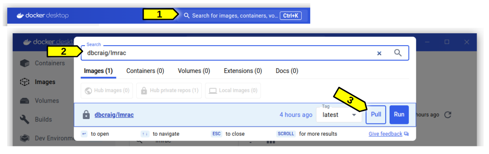

#### Create a running container from the image

You should now see the dbcraig/lmrac:latest image in the Images view. Highlight this image and click on the Run icon under Actions.

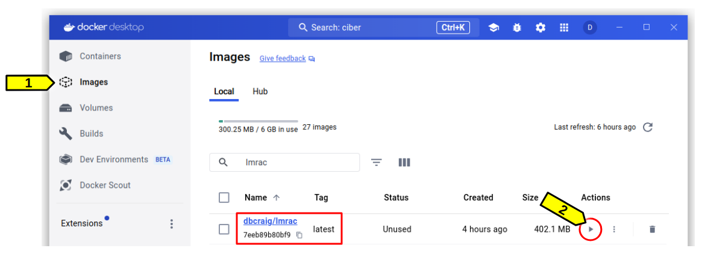

#### Container setting

Before running the image set the parameters so that LmRaC has API keys and knows where to find your data.


#### Launch the LmRaC application
xxx

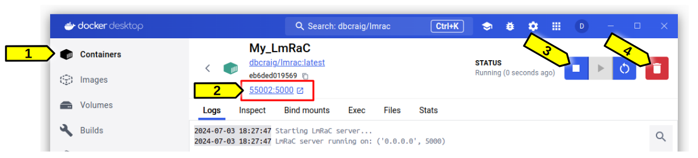

xxx

------------------------------------------------------------------------

## LmRaC Homepage

The LmRaC homepage allows the user to interact with LmRaC as well as open sub-windows for experiments, indexes, functions and saved answers.

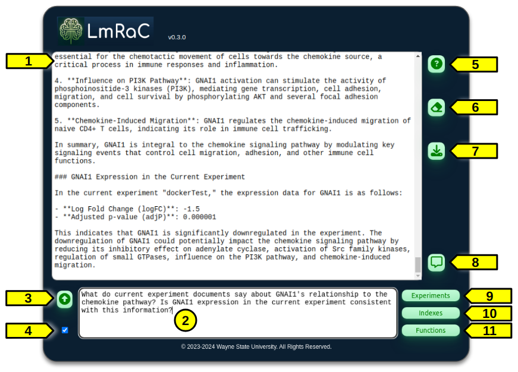

1.  **LmRaC message area** shows all messages from LmRaC as well as user commands and questions.
2.  **User input area** is where the user initiates questions and command to LmRaC.
3.  **Submit** button sends the user input to LmRaC.
4.  **Submit on ENTER** checkbox allows the user to send input simply by pressing the Enter key in the user input area (same as clicking on the Submit button).
5.  **Help** button prompts the user to type "help" in the user input area.
6.  **Erase** button clears the LmRaC message area.
7.  **Download** button allows the user to download the entire contents of the LmRaC message area to a file.
8.  **Answers** icon opens the Answers window from which all saved answers can be viewed.
9.  **Experiments** button opens the Experiments window which shows all available experiments.
10. **Indexes** button opens the Indexes window which shows all available indexes.
11. **Functions** button opens the Functions window which shows all available function libraries.

### Commands
Although the user input area is typically used to ask questions, it can also be used to enter commands. LmRac understands the following commands:

- **Help**
  - **General** xx
  - **Indexes** xx
  - **Experiments** xx
  - **Functions** xx
  - **Questions** xx
  - **Examples** xx
- **General Questions** xx
- **Experiment Questions** xx
- **Indexes**
  - **Set Current Index** xx
  - **Show Current Index** xx
  - **List Indexes** xx
- **Experiments**
  - **Set Current Experiment** xx
  - **Show Current Experiment** xx
  - **List Experiments** xx
- **Functions**
  - **Load Function** xx
  - **Unload Function** xx
  - **List Available Functions** xx
  - **List Loaded Functions** xx
  - **Set REST API IP** xx
- **Show Configuration** xx
- **Load Experiment Documents** xx
- **Enable/Disable Debug Messages** xxx
- **Quit** xx

Note that commands should be asked one at a time. Also, LmRaC currently does not remember previous commands or questions.

------------------------------------------------------------------------

## Indexes

The Indexes window can be opened by clicking on the Indexes button on the [LmRaC Homepage](#LmRaC-Homepage).

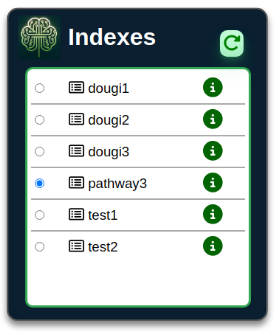

xxx

------------------------------------------------------------------------

## Experiments

The Experiments window can be opened by clicking on the Experiments button on the [LmRaC Homepage](#LmRaC-Homepage).

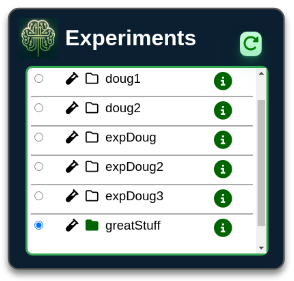

xxx

------------------------------------------------------------------------

## Functions

The Functions window can be opened by clicking on the Functions button on the [LmRaC Homepage](#LmRaC-Homepage).

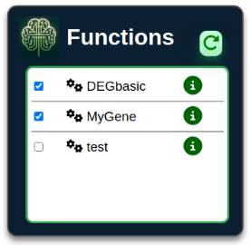

xxx

------------------------------------------------------------------------

## Answers

The Answers window can be opened by clicking on the Answers icon on the [LmRaC Homepage](#LmRaC-Homepage).

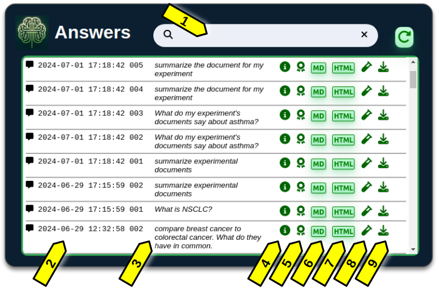

1. **Search** can be used to select only answers with the specified text in either the question or the answer (search is case insensitive).
2. **Timestamp** shows the date and time of the session an answer was created along with a sequence number for the anwer within that session.
3. **Question** text shows the original question.
4. **Answer Summary** can be shown by hovering over the info icon.
5. **Assessment** of the qualify of a general question (not experiment questions) can be shown by hovering over the ribbon icon.
6. **MD** button opens the full text of the answer as a markdown document. See [Markdown Viewing](#Markdown-Viewing) for how to setup your browser to automatically display markdown.
7. **HTML** button opens the full text of the answer as an HTML document.
8. **Test Tube** icon is used to select answers for saving to experiments.
9. **Download** icon is used to download the full text of the answer as a markdown document.

Once you select one or more answers (by clicking on the test tube), the answers save dialog opens in the Answers window.

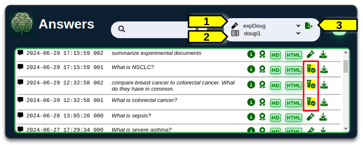

**Select Answers:** Click on the test tube next to the answer you want to add. The test tube will be highlighted with a check mark. You may select as many answers as you wish (see Red highlight).

1. Select the destination experiment name (the current experiment, if any, will have an '*' next to its name).
2. Select the index for the document embeddings. Remember that these documents will only be searchable when this index set as current.
3. Once both the experiment and index have been selected, click on the copy documents icon.

Answers are copied to the experiment and added to the index (i.e., embeddings computed) in the background. This typically takes less than a minute to complete.

------------------------------------------------------------------------

## Configuration

If no user configuration is supplied, LmRaC will use the following defaults. Note that the root /app/user/ is how the container sees your mounted volume. So, if ~/my-directory/lmrac-work/ is mounted when starting Docker, this will be /app/user/

```         
Session Logs Directory  : /app/user/sessions/
Final Answers Directory : /app/user/sessions/finalAnswers/
Experiments Directory   : /app/user/experiments/
Vocabularies Directory  : /app/user/vocab/
Functions Directory     : /app/user/
Indexes Directory       : /app/user/
Vocab Directory         : /app/user/
  Vocab Genes           : hgnc_complete_set.symbol.name.entrez.ensembl.uniprot.tsv
  Vocab Pathways        : KEGG.pathways.refs.csv
  Vocab Diseases        : MESH.diseases.csv

Functions REST API IP   : 172.17.0.2:5001
```

In addition, default vocabulary files for genes, diseases and pathways will be copied into the vocab/ folder.

When quitting LmRaC the configuration is saved to config/LmRaC.config

### Markdown Viewing

LmRaC answers use [standard Markdown](https://www.markdownguide.org/getting-started/) to improve readability and add hyperlinks (e.g., to citations). Although you can use a dedicated Markdown editor or note-taking application to view LmRaC answers, you can also use a browser extension/add-on to automatically render Markdown in your favorite browswer.

[Markdown Viewer](https://github.com/simov/markdown-viewer) is a browser extension compatible with all major browsers. Follow the simple install instructions for your browser then from ADVANCED OPTIONS for the extension [enable Site Access](https://github.com/simov/markdown-viewer?tab=readme-ov-file#enable-site-access) for the LmRaC URL:

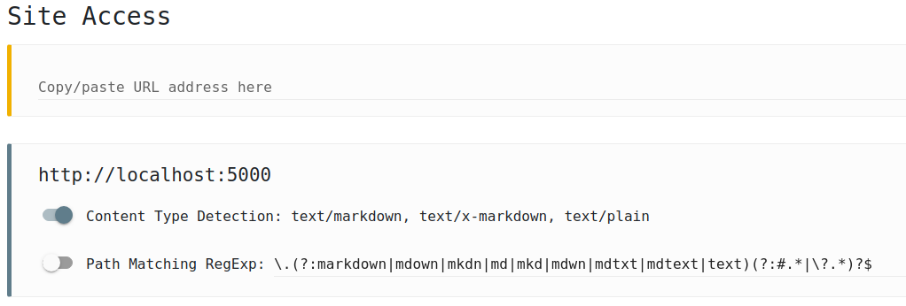

------------------------------------------------------------------------

## Usage - Q and A

LmRaC is specifically designed to answer questions regarding genes, disease and biological pathways. It does this by searching [NIH PubMed](https://pubmed.ncbi.nlm.nih.gov/) for related journal articles. Articles are indexed using text embedding and tagged with metadata corresponding to their search (e.g., KEGG, MeSH or gene identifiers). \### Setting an Index

The **index** is the vector database used to search for related information. LmRaC does not answer questions using GPT4, instead it searches PubMed for related publications and then assembles this information into an answer. Initially, an index is empty. It is then populated as questions are asked about particular genes, diseases and/or pathways.

### Asking a Question

Questions are evaluated to determine what, if any, genes, diseases and/or pathways are explicitly -- or, in some cases, implicitly -- mentioned. Identified terms are then matched against vocabulary lists for each type to associate terms with unique identifiers which can then be used as metadata for subsequent searches.

The detail of an answer is determined by a number between 1 and 7 with 1 answering the question only. Detail of 2-7 generated sub-questions related (in the opinion of GPT4) to the original question. Once the original question and all sub-questions have been answered, they are edited into a single final answer along with paragraph level citations to all sources used in answering the question.

Feedback is also provided by GPT4 on the accuracy and completeness of the answer.

### Providing PubMed Sources

When a term is not recognized (i.e., no embedding has the identifier as metadata), the user is given the option to search PubMed for associated journal articles. These are then analyzed and embeddings stored in Pinecone for subsequent searches. While pathways and diseases initiate a single search, pathways are searched in two stages. In the first stage publications used in the curation of the pathway (these references are part of KEGG) are used as "primary" sources. Citations to each of these primary sources are then collected from PubMed as "secondary" sources. Secondary sources represent the results of more recent research.

### Tips

> **What's Enough?** Do not feel you must populate an index with hundreds of articles. Often, answers require only a few articles. Since searches return results sorted by relevance, it is often sufficient to only download 10 of the best citations to answer common questions.

> **Pathway References:** When asking a question about pathways in particular, explicitly mention the pathway. For example, "How is smoking related to the NSCLC pathway?" is more likely to reference both the pathway for NSCLC (KEGG [hsa0522](https://www.genome.jp/pathway/hsa05223)) and the disease (MeSH [D002289](https://meshb.nlm.nih.gov/record/ui?ui=D002289)).

> **How Detailed?** More detailed answers aren't always better. Since the requested complexity (i.e., detail) determines the number of sub-questions generated, detail should be correlated with the complexity of the question, otherwise LmRaC will likely generate significantly redundant answers. Ask for more detail when there are expected implicit questions in the original question.

------------------------------------------------------------------------

## Usage - Experiments

### Experimental Results

xxx DEG example

### Creating an experimental context

xxx

#### Saving Answers to Experiments

saving answers to experiment from Answers dialog

#### Manual upload

xxx Using the LmRaC interface to load ... so embeddings are created

------------------------------------------------------------------------

## Usage - User-Defined Functions

xxx

### Setting up the REST API Server

Clone the base REST API server from this GitHub repository, then build the Docker image for the functions server.

```         
git clone https://github.com/dbcraig/LmRaC.git
docker build -t lmracrest:latest .
```

Run the functions REST API server:

```         
cd <your-lmrac-root>
docker run -it -v $(pwd)/work:/app/user -p 5001:5001 lmracrest
```

When the server starts up it will show the IP:port on which it is running.

LmRaC must know this IP:port in order to make function requests. You can edit the LmRaC.config file (see [Configuration](#configuration)) so that the *functionsREST* key value is set to IP:port (e.g., "172.17.0.2:5001") or you can set the IP:port dynamically be asking LmRaC to set the value (e.g., "Please set the functions REST API IP and port to 172.17.0.2:5001")

### Adding Functions

xxx

### Using Functions

xxx Load the function ... it will be used based on the description

------------------------------------------------------------------------

## Indexes and Experiments and Functions

Indexes are purposely independent of Experiments.

Functions are purposely independent of Experiments.

With flexibility comes responsibility. xxx

------------------------------------------------------------------------

## Troubleshooting

> **LmRaC isn't calling my function:** The most common cause for this is that the function has not been loaded. Although function files are read and compiled at initialization, they must also be *loaded* in order to be available for questions. This allows LmRaC to focus only on functions relevant to the task at hand. Note that what functions are loaded is saved to the configuration file, so after restarting LmRaC your functions are automatically re-loaded.

> **Memory:** Because LmRaC uses multiprocessing extensively, complex questions can require significant memory resources while documents are being processed. We recommend a minimum of 1GB for the Docker container, though 2GB may be necessary for large multi-part questions. The error **A process in the process pool was terminated abruptly while the future was running or pending** is usually an indication that LmRaC ran out of memory.

> **Rate Limits:** All servers have rate limits (i.e., maximum number of requests per second). In the case of PubMed this is fix. For OpenAI this increases over time for users. In all cases LmRaC will retry a request in the event of a rate limit error. Retries employ an exponential backoff strategy that, in most cases, is sufficient for the request to ultimately succeed. As a consequence, users may see slower response times when using LmRaC with a new OpenAI account.

> **Low Assessment Scores:** Note that it is not unusual for GPT4 to assess final answers as poor. Most often this is due to two factors: (1) GPT4 flags citations as "fake" because they occur after the training cutoff date of GPT4; or, (2) GPT4 objects to the complexity of the answer as exceeding the scope of the original question, or inappropriate for a lay audience. On the other hand, these assessment often offer insightful critiques that may prompt further questions.

------------------------------------------------------------------------

## How To Cite

*Coming Soon!*

## Contact

Douglas Craig : [craigdou\@med.umich.edu](mailto:craigdou@med.umich.edu){.email}
