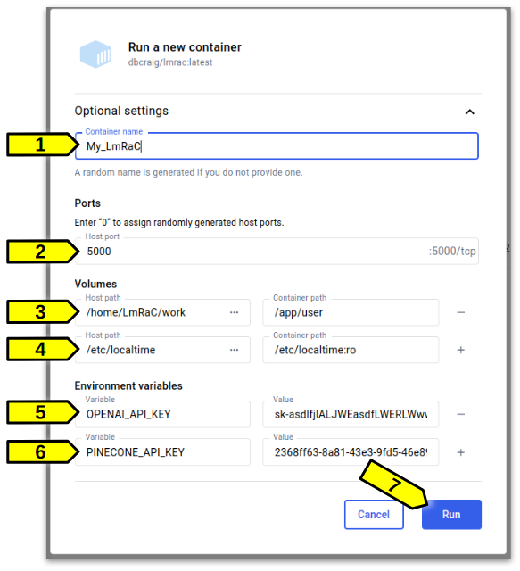

LmRaC (Language Model Research Assistant & Collaborator) is an LLM-based web application that enables users to explore, understand and interrogate their own biological experiments by:

-   incrementally building custom knowledge bases from the scientific literature, and

-   using custom functions to make quantitative data available to the language model.

LmRaC uses a multi-tier retrieval-augmented generation (RAG) design to index: domain knowledge, experimental context and experimental results. LmRaC is fully data-aware through the use of a user-defined REST API that allows the LLM to ask questions about data and results.

------------------------------------------------------------------------

## Table of Contents

> ### Getting Started
> 
> * [Prerequisites](#Prerequisites)
> * [Quick Start](#Quick-Start)
> * [Installation](#Installation)

> ### Application Windows & Configuration
> 
> * [LmRaC Homepage](#LmRaC-Homepage)
>   * [Commands](#Commands)
> * [Indexes Window](#Indexes-Window)
> * [Experiments Window](#Experiments-Window)
> * [Functions Window](#Functions-Window)
> * [Answers Window](#Answers-Window)
> * [Configuration](#Configuration)

> ### Usage, Workflow & Troubleshooting
> 
> * [Usage: Q & A](#Usage---Q-and-A)
> * [Usage: Experiments](#Usage---Experiments)
> * [Usage: User-Defined Functions](#Usage---User-Defined-Functions)
> * [Indexes and Experiments and Functions](#Indexes-and-Experiments-and-Functions)
> * [Troubleshooting](#Troubleshooting)

> ### Credits
> 
> * [How To Cite](#How-To-Cite)
> * [Contact](#Contact)

------------------------------------------------------------------------

## Prerequisites

### Docker

LmRaC runs as a web application in a Docker container. Users must therefore have either [Docker Engine](https://docs.docker.com/engine/install/) (CLI - Linux) or [Docker Desktop](https://docs.docker.com/desktop/install/linux-install/) (GUI - Linux, Mac, Windows) installed. If running Docker in the cloud, we recommend a container optimized OS. See [Installation](#Installation) below for details on installing Docker.

### OpenAI

LmRaC uses OpenAI's GPT-4o API to perform many language related functions. GPT does not per se answer user questions. Instead, it is used to assess the usefulness of primary source material for answering questions. Users of LmRaC must have an active OpenAI API account with an API key (see [OpenAI API keys](https://platform.openai.com/docs/quickstart)). Once a key has been created, it must be passed into the Docker container. This is typically done by creating an environment variable and then passing a reference to this variable in the **docker run** command using the **-e** option. 

```         
export OPENAI_API_KEY="sk-asdlfjlALJWEasdfLWERLWwwSFSSEwwwww"
```

When using Docker Desktop, keys are part of the container's Run settings (see [Container settings](#Container-settings)).

### Pinecone

[Pinecone](https://app.pinecone.io/) is a vector database used by LmRaC to store and search vector embedding of source material (i.e., indexes). Users must have an active Pinecone account then [create a Serverless API Key](https://docs.pinecone.io/guides/projects/understanding-projects#api-keys) from the Pinecone console. Once a key has been created, it must be passed into the Docker container. This is typically done by creating an environment variable and then passing a reference to this variable in the **docker run** command using the **-e** option.

```         
export PINECONE_API_KEY="2368ff63-8a81-43e3-9fd5-46e892b9d1b3"
```

When using Docker Desktop, keys are part of the container's Run settings (see [Container settings](#Container-settings)).

------------------------------------------------------------------------

## Quick Start

1. **Docker Installation:** If you don't already have Docker installed see [Installation](#Installation) below for details on how to install it.

2. **OpenAI API Key:** Create an OpenAI API account. Note that this is different from an OpenAI ChatGPT account. The API account allows LmRaC to talk directly to the OpenAI LLM routines. See [OpenAI](#OpenAI) Prerequisites above for details. You will need to add funds to your account. A typical low-complexity answer costs pennies, so starting with a few dollars is more than enough to try LmRaC.

3. **Pinecone API Key:** Create a Pinecone API account. This API allows LmRaC to efficiently save and search indexes of the document knowledge bases you create. See [Pinecone](#Pinecone) Prerequisites above for details. Note that documents are not store in Pinecone, only vector embeddings and metadata are stored. You will need to add funds to your account. Charges are for loading and retrieving embeddings. Loading the example index costs less than 25 cents. Access is typically a few pennies for answers.

4. **LmRaC Docker Image:** Pull the latest LmRaC image.

   a. *If you're using Docker Engine:* From the command line pull the latest lmrac Docker image and run the container.

    ```         
    docker pull dbcraig/lmrac:latest
    cd <your-lmrac-root>
    docker run -m1024m -it -e OPENAI_API_KEY=${OPENAI_API_KEY} -e PINECONE_API_KEY=${PINECONE_API_KEY} -v $(pwd)/work:/app/user -v /etc/localtime:etc/localtime:ro -p 5000:5000 dbcraig/lmrac
    ```

   b. *If you're using Docker Desktop:* Open Docker Desktop and search for *dbcraig/lmrac* and then pull the *latest* image. From the Images view click on Run to create Container. Set the container parameters for: ports, volumes and environment variables. Click Run to start the container. See [Installation](#Installation) below for detailed screen shots.
  
    Note, we recommend 1GB of memory and also mounting */etc/localtime* to insure container time is the same as server time.

5. **Run LmRaC:**

   a. *If you're using Docker Engine:* Open the web app from you browser. For example: <http://localhost:5000> if you've mapped the container port to 5000.
  
   b. *If you're using Docker Desktop:* From the Docker Desktop Container view open the web app using the container's URL hyperlink.
  
    The LmRaC homepage will open and LmRaC will initialize. Any problems (e.g., missing keys) will be reported.

    

    The first time you run LmRaC it will use a default configuration. See [Configuration](#Configuration) below for how to customize the configuration. When you quit LmRaC your current configuration is saved to *config/LmRaC.config* in the the mounted directory.

    **TIP:** Use a new window when first starting LmRaC. DO NOT use the browser reload button to restart LmRaC. This can cause synchronization problems between the browser (client) and the Docker container (server). If user questions and answers seem to be out of sync, simply restart the Docker container, and reopen LmRaC in a new window.

6. **Create an Index:** Since building a knowledge base can take time, start with the loadable example index. 

   a. *Create an Index:* Type *index = my-index* in the user input area. LmRaC will respond with *Index 'my-index' not found. Create new index? [y/N]*  Change the default *no* to *yes* and press enter. LmRaC will ask for an *Index description:* Enter a short description and press enter. After a few seconds LmRaC will respond with the size of the new index.

    ```
    [user]  index = my-index
    [LmRaC] Calling  functionName: cmd_SET_CURRENT_INDEX
    [LmRaC] Index 'my-index' not found. Create new index? [y/N] 
    [user]  yes
    [LmRaC] Index description:
    [user]  My new index to try LmRaC.
    [LmRaC] Creating new index 'my-index'...
    [LmRaC] The current index has been set to 'my-index'.
    Index sizes are:
    RAGdom : my-index (0)
    RAGexp : my-index-exp (0)
    ```

   Each index has two parts: 

   - **RAGdom:** the general domain knowledge index for primary material (i.e., PubMed articles)
   - **RAGexp:** the experiment specific index for secondary material (e.g., saved answers, protocols, background/context knowledge)

   b. *Populate the index:* Open the [Indexes Window](#Indexes-Window). If your index is not already selected, click on the radio button next to it.

    

    Click on the upload icon next to your index. Select *exampleIDX* and then click upload. This will embeddings from a pre-built index into your index. The upload should take less than 5 minutes. Press the refresh button periodically to check for completion.

    *exampleIDX.idx* indexes nearly 6000 paragraphs from about 130 journal articles on the disease breast cancer ([D001943](https://meshb.nlm.nih.gov/record/ui?ui=D001943)), its associated pathway ([hsa05224](https://www.genome.jp/pathway/hsa05224)), and 10 of the most important genes ([TP53](https://www.genecards.org/cgi-bin/carddisp.pl?gene=TP53), EGFR, BRCA1, BRCA2, CASP8, CHEK2, ERBB4, FOXP1, CDKN2A, AKT1).

    **TIP:** Build indexes incrementally in smaller chunks. DON'T ask for 100's of references for every pathway, gene or disease. Most answers can be had using only 2 to 5 references. This is especially true of pathways which often have a dozen or more primary references plus secondary citations. Initially, ask for only 2 or 3 secondary citations for each primary. This can end up being 100+ high-quality documents for one pathway, which is more than enough for many questions.

7. **Ask a Question:** Ask a question. LmRaC will analyze the question for any mention of genes, diseases or pathways using its vocabularies (see [Configuration](#Configuration)). It will summarize what it finds as the Search Context. If the index already contains information about any of these items, you will be given the option of updating the index (i.e., searching for more documents). If the index does not include information about one or more item in the question, it will initiate a search of PubMed and populate the index.
    
    ```
    [user] What are the most important genes in the KEGG breast cancer pathway?
    [LmRaC] How detailed an answer would you like (1-7)?
    [user] 1
    ## Question
    'What are the most important genes in the KEGG breast cancer pathway?'
    Answer complexity: 1
    Analyzing question to determine genes, pathways and diseases...
    
    ## Search Context
    Genes : []
    Pathways :
    	hsa05224 : Breast cancer
    		References (curated): [24649067, 27390604, 20436504, 23000897, 22178455, 24596345, 23988612, 22722193, 25907219, 16113099, 24111892, 23702927, 20087430, 24291072, 25544707, 21965336, 26028978, 19088017, 21898546, 11737884, 21076461, 20971825, 26968398, 26040571, 23196196, 23881035, 25013431, 11879567, 15343273]
    Diseases :
    	D001943 : Breast Neoplasms
    ## PubMed Search : Diseases
    ### Disease MESH ID D001943 : Breast Neoplasms
    [LmRaC] 
    References exist for disease 'Breast Neoplasms'.
    Skip download from PubMed? [Y/n] 
    [user] yes
    ## PubMed Search : Pathways
    ### Pathway hsa05224 : Breast cancer
    [LmRaC] 
    References exist for pathway 'Breast cancer'.
    Skip download from PubMed? [Y/n] 
    [user] yes
    
    ## Answer Question
    Question : What are the most important genes in the KEGG breast cancer pathway?
    
    Determining sub-questions to answer...
    ```

    **TIP:** Ask for simple answers first. A complexity of "1" will likely give you a good summary answer from which you can ask more detailed questions. Asking for a "7" will yield a longer answer, but likely with more redundant information.

8. **View the Answer:** Answers are displayed during processing and saved in the *sessions/finalAnswers/* directory along with information about the original query, generated sub-queries, references for the answer and a GPT4 assessment of the final answer.

    To view the final answer (and its quality assessment) open the [Answers Window](#Answers-Window) by clicking on the Answers icon of the ([LmRaC Homepage](#LmRaC-Homepage)). From the Answers window answers can be viewed as markdown, HTML, downloaded, and/or saved to experiments as supplemental experiment documents.

9. **Expand your Knowledge:** You can add to your index by asking a question about another gene, pathway or disease. Try it!

10. **Quitting LmRaC** Exit LmRaC by typing "bye" or "exit" or "adios" in whatever language you prefer. You will be given the option to save your current configuration. The saved configuration includes your current index, experiment and any loaded functions. Once you quit the Docker container will exit.

### Next steps

Once you've asked some questions and received answers, you'll probably want to setup experiments into which you can save answers and upload quantitative results. You can then ask questions about your own experimental results! See 
[Experiments](#Usage---Experiments) and [Functions](#Usage---User-Defined-Functions) for more details on using the example experiment and functions.

------------------------------------------------------------------------

## Installation

LmRaC is a containerized web application. That means, everything you need to "install" and run LmRaC is packaged into a single Docker container. So, the only thing you need to install for any operating system is Docker. Once Docker is installed you simply "pull" the latest LmRaC release from [DockerHub](https://hub.docker.com/) and run it from Docker. That's it! No worrying about installing the correct version of Python or this or that library or confusing dependencies. It's all in the container!

If you're running on Linux then you have the option of installing the command-line version of Docker known as Docker Engine (aka Docker CE), otherwise you'll need to install Docker Desktop.

### Docker Engine (Linux)

#### Install Docker Engine

Installation instructions for Linux distros can be found at  [Install Docker Engine](https://docs.docker.com/engine/install/)

#### Pull and run the latest LmRaC image

```         
docker pull dbcraig/lmrac:latest
cd <your-lmrac-root>
docker run -m1024m -it -e OPENAI_API_KEY=${OPENAI_API_KEY} -e PINECONE_API_KEY=${PINECONE_API_KEY} -v $(pwd)/work:/app/user -v /etc/localtime:etc/localtime:ro -p 5000:5000 dbcraig/lmrac
```

Open the [LmRaC Homepage](#LmRaC-Homepage) from <http://localhost:5000>.

### Docker Desktop (Linux / Mac / Windows)

#### Install Docker Desktop

For instructions on how to install Docker Desktop, see:

- [Docker Desktop for Linux](https://docs.docker.com/desktop/install/linux-install/)
- [Docker Desktop for Mac (macOS)](https://docs.docker.com/desktop/install/mac-install/)
- [Docker Desktop for Windows](https://docs.docker.com/desktop/install/windows-install/)

#### Pull the latest LmRaC image

From the Docker Desktop search for *dbcraig/lmrac* and then pull the *latest* image. This will copy the latest release of LmRaC to your local machine.


1. **Search:** Click on the search area to open the Search dialog.
2. **Search dialog:** Search for *dbcraig/lmrac*. Set the Tag dropdown to *latest* (default).
3. **Pull:** Click on the Pull button to download the latest LmRaC image to Docker Desktop.

#### Create a running container from the image

You should now see the dbcraig/lmrac:latest image in the Images view. Highlight this image and click on the Run icon under Actions.


1. **Images view:** Click on Images to see a list of all pulled images.
2. **Run:** Find *dbcraig/lmrac* in the list and click on the run icon (play arrow) to open the run dialog.

#### Container settings

Before running the image set the parameters so that LmRaC has API keys and knows where to find your data.



A note on terminology: the Docker *image* is a read-only template with all the information needed for creating a running program. An instance of the running program (created from the *image*) is called a *container*. For LmRaC the container is a web server that you can interact with through a browser.

1. **Container name:** (optional) You can give the container (the running program) a name, otherwise Docker Desktop with generate a random name.
2. **Ports:** Enter a "0" for Docker Desktop to generate a random port on which to find the LmRaC application. Though the LmRaC container runs on port 5000, it doesn't know what port the host machine has available. This allows Docker Desktop to assign an available port and map it LmRaC's internal port (this is analogous to how your local directory is mapped to LmRaC's internal /app/user).
3. **Volumes (work directory):** Select the path on your host (the machine running Docker Desktop) that you want to be the user root (*/app/user*) for LmRaC. This allows the container to write files to your host (the machine running Docker Desktop). For security, Docker containers are not allowed to access anything on the host machine *unless* you explicitly map (aka mount) a directory into the container.
4. **Volumes (localtime):** (optional) Time in the container is not necessarily the same as time on the host running Docker Desktop. Mapping the */etc/localtime* insures that the timestamp LmRaC uses to name answers and logs is aligned with the time on your Docker Desktop host.
5. **Environment variables (OpenAI API):** Pass in the literal API key value that LmRaC will use to talk to the OpenAI GPT-4o model.
6. **Environment variables (Pinecone API):** Pass in the literal API key value that LmRaC will use to talk to the Pinecone vector database.
7. **Run:** Press Run to create the running container.

#### Launch the LmRaC application

You should now see the container you just created running in the Containers view.


1. **Containers view:** Click on Containers to see a list of all containers. This includes running as well as stopped containers. 
2. **Container URL line:** Since LmRaC is a web application and you specified a Port of "0" as part of the [Run configuration](#Container-settings), you will see a hyperlink created by Docker Desktop to launch LmRaC. Click on this to open the browser to see the [LmRaC Homepage](#LmRaC-Homepage).
3. **Stop container:** Once you are done running LmRaC you can clean up be stopping the running container. This frees up CPU and memory on the host.
4. **Delete container:** Stopped containers exist until you delete them since they can be re-started. Note that deleting a container *does not* delete or otherwise affect the image it was created from.

------------------------------------------------------------------------

## LmRaC Homepage

The LmRaC homepage allows the user to interact with LmRaC as well as open sub-windows for experiments, indexes, functions and saved answers.


1.  **LmRaC message area:** Shows all messages from LmRaC as well as user commands and questions.
2.  **User input area:** Where the user types questions and commands for LmRaC.
3.  **Submit:** Button to send the user input to LmRaC.
4.  **Submit on ENTER:** Checkbox that allows the user to send input simply by pressing the Enter key in the user input area (same as clicking on the Submit button). Uncheck this if you want to include linefeeds in your input.
5.  **Help:** Button to prompt the user to type "help" in the user input area.
6.  **Erase:** Button to clear the LmRaC message area.
7.  **Download:** Button to allow the user to download the entire contents of the LmRaC message area to a file.
8.  **Answers:** Button to open the Answers window from which all saved answers can be viewed.
9.  **Experiments:** Button to open the Experiments window which shows all available experiments.
10. **Indexes:** Button to open the Indexes window which shows all available indexes.
11. **Functions** Button to open the Functions window which shows all available function libraries.

### Commands
Although the user input area is typically used to ask questions, it can also be used to enter commands. LmRac understands the following commands:

#### Help Commands
- **Help**  A summary of available help.
- **Help indexes**  General information about indexes.
- **Help experiments**  General information about experiments. 
- **Help functions**  General information about functions.
- **Help questions**  General information about asking questions.
- **Help examples**  Some sample questions you can ask.
  
#### Index Commands
- **Set current index to** *\<index-name\>*  Set/create the index for answering questions.
- **Show current index**  Show the name of the current index.
- **List indexes**  List the available indexes.
  
#### Experiment Commands
- **Set current experiment to** *\<experiment-name\>*  Set/create an experiment folder.
- **Show current experiment**  Show the name of the current experiment.
- **List experiments**  List the available experiments.
  
#### Function Commands
- **Load function** *\<function-name\>*  Make a function library unavailable for question answering.
- **Unload function** *\<function-name\>*  Make a function library available for question answering.
- **List available functions**  List function libraries that have been successfully compiled and are available to be loaded.
- **List loaded functions**  List function libraries that will be used when answering questions.
- **Set REST API IP**  Set the IP and port on which LmRaC will make function requests to the user-defined REST API server.
  
#### Other Commands
- **Show configuration**  Show the current configuration and settings.
- **Load experiment documents to** *\<experiment-name\>*  Manually load and compute embeddings for a document then save it to an experiment. User will be prompted for the file name.
- **Enable/Disable debug messages**  Show verbose function calls and intermediate results. Can be useful for rephrasing more complex questions.
- **Quit**  Save the current configuration and shutdown the homepage and server.

Note that commands should be asked one at a time. Also, LmRaC currently does not remember previous commands or questions.

------------------------------------------------------------------------

## Indexes Window

The Indexes window can be opened by clicking on the Indexes button on the [LmRaC Homepage](#LmRaC-Homepage).


Available indexes are listed with the current index, if any, selected. Select an index by clicking on its radio button. This is equivalent to asking LmRaC on the [LmRaC Homepage](#LmRaC-Homepage) to set the index.

Hovering over the information icon displays the index description, if any, from when the index was created.

Only one index may be selected at a time.

------------------------------------------------------------------------

## Experiments Window

The Experiments window can be opened by clicking on the Experiments button on the [LmRaC Homepage](#LmRaC-Homepage).


Available experiments are listed with the current experiment, if any, selected. Select an experiment by clicking on its radio button. This is equivalent to asking LmRaC on the [LmRaC Homepage](#LmRaC-Homepage) to set the experiment.

Hovering over the information icon displays the experiment description, if any, from when the experiment was created.

Clicking on the folder icon shows the contents of the experiment folder: files in the experiment root, and the *docs/* folder, if any. The *docs/* folder is where [saved answers](#Saving-Answers-to-Experiments) and [uploaded experiment documents](#Manual-document-upload) are saved.

Only one experiment may be selected at a time.

------------------------------------------------------------------------

## Functions Window

The Functions window can be opened by clicking on the Functions button on the [LmRaC Homepage](#LmRaC-Homepage).


Available functions are listed with all loaded functions, if any, checked. Load a function by clicking on its checkbox. This is equivalent to asking LmRaC on the [LmRaC Homepage](#LmRaC-Homepage) to load the function. Unload the function by unchecking.

Hovering over the information icon displays the function DESCRIPTION, if any, from the function definition file (*.fn*).

Any number of functions may be loaded. However, keep in mind that all loaded functions are passed to GPT4 when asking *any* question. This allows GPT4 to make use of any loaded function when answering a question, but increases the number of input tokens. So, if a function is not needed, do not load it. This improves the accuracy of the answer and reduces cost.

------------------------------------------------------------------------

## Answers Window

The Answers window can be opened by clicking on the Answers icon on the [LmRaC Homepage](#LmRaC-Homepage).


1. **Search** can be used to select only answers with the specified text in either the question or the answer (search is case insensitive).
2. **Timestamp** shows the date and time of the session an answer was created along with a sequence number for the anwer within that session.
3. **Question** text shows the original question.
4. **Answer Summary** can be shown by hovering over the info icon.
5. **Assessment** of the qualify of a general question (not experiment questions) can be shown by hovering over the ribbon icon.
6. **MD** button opens the full text of the answer as a markdown document. See [Markdown Viewing](#Markdown-Viewing) for how to setup your browser to automatically display markdown.
7. **HTML** button opens the full text of the answer as an HTML document.
8. **Test Tube** icon is used to select answers for saving to experiments.
9. **Download** icon is used to download the full text of the answer as a markdown document.

Once you select one or more answers (by clicking on the test tube), the answers save dialog opens in the Answers window.


### Saving Answers to Experiments
Click on the test tube next to the answer you want to add. The test tube will be highlighted with a check mark. You may select as many answers as you wish (see Red outline).

1. Select the destination Experiment name (the current experiment, if any, will have an '*' next to its name).
2. Select the Index for the document embeddings. Remember that these documents will only be searchable when this index set as current.
3. Once both the Experiment and Index have been selected, click on the copy documents icon.

Answers are copied to the experiment *docs/* folder and added to the index (i.e., embeddings computed) in the background. This typically takes less than a minute to complete.

------------------------------------------------------------------------

## Configuration

If no user configuration is supplied, LmRaC will use the following defaults. Note that the root /app/user/ is how the container sees your mounted volume. So, if ~/my-directory/lmrac-work/ is mounted when starting Docker, this will be /app/user/

```         
Session Logs Directory  : /app/user/sessions/
Final Answers Directory : /app/user/sessions/finalAnswers/
Experiments Directory   : /app/user/experiments/
Vocabularies Directory  : /app/user/vocab/
Functions Directory     : /app/user/
Indexes Directory       : /app/user/
Vocab Directory         : /app/user/
  Vocab Genes           : hgnc_complete_set.symbol.name.entrez.ensembl.uniprot.tsv
  Vocab Pathways        : KEGG.pathways.refs.csv
  Vocab Diseases        : MESH.diseases.csv

Functions REST API IP   : 172.17.0.2:5001
```

In addition, default vocabulary files for genes, diseases and pathways will be copied into the vocab/ folder.

When quitting LmRaC the configuration is saved to *config/LmRaC.config*

### Markdown Viewing

LmRaC answers use [standard Markdown](https://www.markdownguide.org/getting-started/) to improve readability and add hyperlinks (e.g., to citations). Although you can use a dedicated Markdown editor or note-taking application to view LmRaC answers, you can also use a browser extension/add-on to automatically render Markdown in your favorite browswer.

[Markdown Viewer](https://github.com/simov/markdown-viewer) is a browser extension compatible with all major browsers. Follow the simple install instructions for your browser then from ADVANCED OPTIONS for the extension [enable Site Access](https://github.com/simov/markdown-viewer?tab=readme-ov-file#enable-site-access) for the LmRaC URL:


------------------------------------------------------------------------

## Usage - Q and A

LmRaC is specifically designed to answer questions regarding genes, disease and biological pathways. It does this by searching [NIH PubMed](https://pubmed.ncbi.nlm.nih.gov/) for related journal articles. Articles are indexed using text embeddings and tagged with metadata corresponding to their search (e.g., KEGG, MeSH or gene identifiers). 

### Setting an Index

The **index** is the vector database used to search for related information. LmRaC does not answer questions using GPT4's knowledge, instead it searches PubMed for related publications and then assembles this information into an answer. This virtually eliminates any chance of hallucinations. Initially, an index is empty. It is then populated as questions are asked about particular genes, diseases and/or pathways.

### Asking a Question

Questions are evaluated to determine what, if any, genes, diseases and/or pathways are explicitly -- or, in some cases, implicitly -- mentioned. Identified terms are then matched against vocabulary lists for each type to associate terms with unique identifiers which can then be used as metadata for subsequent searches.

The detail of an answer is determined by a number between 1 and 7 with 1 answering the question only. Detail of 2-7 generated sub-questions related (in the opinion of GPT4) to the original question. Once the original question and all sub-questions have been answered, they are edited into a single final answer along with paragraph level citations to all sources used in answering the question.

Feedback is also provided by GPT4 on the accuracy and completeness of the answer.

### Providing PubMed Sources

When a term is not recognized (i.e., no embedding has the identifier as metadata), the user is given the option to search PubMed for associated journal articles. These are then analyzed and embeddings stored in Pinecone for subsequent searches. While pathways and diseases initiate a single search, pathways are searched in two stages. In the first stage publications used in the curation of the pathway (these references are part of KEGG) are used as "primary" sources. Citations to each of these primary sources are then collected from PubMed as "secondary" sources. Secondary sources represent the results of more recent research.

### Tips

> **What's Enough?** Do not feel you must populate an index with hundreds of articles. Often, answers require only a few articles. Since searches return results sorted by relevance, it is often sufficient to only download 10 of the best citations to answer most common questions.

> **Pathway References:** When asking a question about pathways in particular, explicitly mention the pathway. For example, "How is smoking related to the NSCLC pathway?" is more likely to reference both the pathway for NSCLC (KEGG [hsa0522](https://www.genome.jp/pathway/hsa05223)) and the disease (MeSH [D002289](https://meshb.nlm.nih.gov/record/ui?ui=D002289)).

> **How Detailed?** More detailed answers aren't always better. Since the requested complexity (i.e., detail) determines the number of sub-questions generated, detail should be correlated with the complexity of the question, otherwise LmRaC will likely generate significantly redundant answers. Ask for more detail when there are expected implicit questions in the original question.

------------------------------------------------------------------------

## Usage - Experiments

A key feature of LmRaC is its ability to answer questions about a user's own experiments and data. Two components make this possible:

- a user-defined experimental context of documents and data
- user-defined functions that answer questions about that data

The context is simply an index, like those created for general questions, that focuses on information about the experiment. Functions are user provided code that retrieves or otherwise manipulates data so that it is available to answer a question. A user needn't "call" the function explicitly, he or she need only describe it and then leave it to LmRaC to use the function if it will aid in answering the question.

### Experimental Results

For example, assume you have an experiment where you have measured differentially expressed genes (DEG) between affected (disease) and unaffected (control) subjects. Typically, this type of experiment results in a file that contains all measured genes, how much they changed between experimental conditions, and the statistical significance of that change. You could ask:

```
[user]  What is the expression of BRCA1 in my experiment?
[LmRaC] The expression of the gene BRCA1 in your experiment "greatStuff" is as follows:
- Log Fold Change (logFC): 1.488
- Adjusted p-value (adjP): 0.000001
```

LmRaC first notices that this is a question about your experiment. Internally it identifies the current experiment as "greatStuff." Then, in attempting to determine the expression of the gene BRCA1 it finds a loaded user-function with the description "Return gene expression results for a list of genes from an experiment." It creates a list with BRCA1 as the only gene and calls the function. The function reads the DEG results, finds BRCA1, and returns its expression. LmRaC incorporates this into the answer above.

See [Usage: User-Defined Functions](#Usage---User-Defined-Functions) for how to create your own functions.

### Creating an experimental context

When asking questions about experiments LmRaC will first search for documents indexed for the experiment. This means documents in the experiment's *docs/* folder. These are either saved answers or uploaded documents (see below). In either case these documents have been copied to the *docs/* folder and, most importantly, had their embeddings computed so that they are available for search.

Creating a context, therefore, means creating a group of documents that provide a focused knowledge base relative to the experiment. This can be background documents on genes, pathways and diseases generated from general questions. It can also include relevant protocol or other background documents that provide details relevant to interpreting your experimental results.

Importantly, one of the strengths of LmRaC is that though it will use this experimental context, it can also search the general literature. Keep this in mind when formulating your questions.

**IMPORTANT** Experiment documents are "authoritative" when asking experimental questions. LmRaC does not implicitly use GPT4 to validate or otherwise confirm the veracity of any document that is uploaded. Therefore, for example, if you upload experiment documents that provide evidence that the world is flat, expect answers to use this "fact." You are the author of your experimental findings!

#### Saving Answers to Experiments

From the [Answers Window](#Answers-Window) select any answers you want saved to a specific experiment. Select an index. Click on the copy documents icon. Keep in mind that when an answer is saved to an experiment, the text of the answer is saved in the experiment directory, but the embeddings (i.e., searchable meaning) are saved in an index along with metadata that links it to the experiment. When asking questions about the experiment, you must use this index.

#### Manual document upload

Documents can also be uploaded to experiments manually. Simply ask LmRaC to "load experiment document to *< experiment >*". You will be prompted for the document name. Once copied to the experiment's *docs/* folder, embeddings will be computed and added to the current index. This makes the document available for questions. 

Although it is possible to simply copy documents into the experiment's *docs/* folder, embeddings will not be computed, therefore, the documents are not searchable when asking questions about the experiment. Use the "load experiment documents" command to make the document available for search.

**IMPORTANT** Docker containers can only see directories that have been mounted using the **-v** command. This means the path to upload documents is relative to the container's mount point. For example, if you run the LmRaC container with **-v $(pwd)/work:/app/user**, LmRaC can only see folders in the work/ directory tree. These are referenced in the container as */app/user*. So, if you want to load a document from *work/my-docs/experimentInfo.txt*, the full path when using the LmRaC load command would be */app/user/my-docs/experimentInfo.txt*.

### Putting it all together

First, create an experimental context for the doug1 experiment:

```
[user]  Describe the expression patterns of BRCA1 in breast cancer
```

Save this answer to the doug1 experiment *docs/* using the [Answers Window](#Answers-Window). Index the answer using the dougi1 index.

Now, ask how my particular DEG results might be interpreted with respect to this context:

```
[user]  set experiment = doug1
...
[user]  set index = dougi1
...
[user]  What is the expression of BRCA1 in my experiment doug1?
        My experiment is studying breast cancer.
        How might this expression be interpreted with respect to what the doug1 experimental documents say about BRCA1 and breast cancer?
```

LmRaC provides the following answer:

> [LmRaC] The expression data for BRCA1 in your experiment "doug1" shows the following:
> 
> - **Log Fold Change (logFC)**: 1.488
> - **Adjusted p-value (adjpv)**: 0.000001
> 
> ### Interpretation:
> 1. **Log Fold Change (logFC)**: A logFC of 1.488 indicates that BRCA1 is upregulated in your breast cancer samples compared to the control. This means that the expression level of BRCA1 is higher in the breast cancer tissues.
> 
> 2. **Adjusted p-value (adjpv)**: The very low adjusted p-value (0.000001) suggests that this upregulation is statistically significant, meaning it is highly unlikely to be due to random chance.
>
> ### Contextual Interpretation:
> BRCA1 (Breast Cancer 1) is a well-known tumor suppressor gene. Mutations in BRCA1 are associated with an increased risk of breast and ovarian cancers. However, the upregulation of BRCA1 in your experiment could indicate a cellular response to DNA damage or stress, as BRCA1 is involved in DNA repair mechanisms.
> 
> In the context of breast cancer, the upregulation of BRCA1 might be a compensatory mechanism where the cells are trying to repair DNA damage more actively. Alternatively, it could reflect a specific subtype of breast cancer where BRCA1 expression is higher.
> 
> To fully understand the implications, you should refer to the specific experimental documents of "doug1" to see how BRCA1 expression is discussed in relation to breast cancer. The documents might provide insights into whether this upregulation is consistent with previous findings or if it suggests a novel aspect of BRCA1's role in breast cancer in your specific experimental conditions.
>

------------------------------------------------------------------------

## Usage - User-Defined Functions

LmRaC functionality is designed to be easily extensible. That is, the range of questions that LmRaC can answer is only constrained by the imagination (and industriousness) of the user. Though primarily intended to facilitate access to user data and results, user-defined functions can also be used to interface to any other resource whether static (e.g., database, resource API) or dynamic (e.g., instrumentation, sensing).

A functionally complete example of the REST API is provided in this GitHub repository in the [RESTserver](RESTserver/) folder. How to build and extend it is described below.

### Quick Start

If you want to try the REST server without building it, a Docker image is available. Keep in mind that this example has limited functionality, but it will give you a quick way to try functions.

**NOTE** this Docker image has been build from the provided GitHub example ([RESTserver](RESTserver/)).

Pull the latest tagged image from Docker Hub. Run LmRaC REST using Docker Engine. If Docker is not installed or you're using Docker Desktop, see the [Installation](#Installation) instructions above. This example server does not use any API keys.

**IMPORTANT** you must mount the same local directory as was used for LmRaC otherwise the REST API will be looking in a directory different from LmRaC and will not find the data files it is returning results from. Also, notice that the REST server is on a different port than LmRaC: 5001.

```         
docker pull dbcraig/lmracrest:latest
cd <your-lmrac-root>
docker run -it -v $(pwd)/work:/app/user -p 5001:5001 dbcraig/lmracrest
```

On startup the LmRaC REST server will print the IP:port it is running on. Make sure that this matches the LmRaC configuration otherwise LmRaC requests will not be received by the REST server. To aid in debugging, this example server echos requests it has received. If you do not see a request, then they are likely being sent to the wrong IP:port address.

You should now be able to ask questions about experimental data (e.g., "What is the expression of BRCA1 in my experiment?") as part of your questions to LmRaC.

### Building your own REST API Server

You can use the provide example as a starting point for building your own REST API server. Clone the base REST API server from this GitHub repository, then build the Docker image for the functions server.

```         
git clone https://github.com/dbcraig/LmRaC.git
docker build -t lmracrest:latest .
```

Run the functions REST API server:

```         
cd <your-lmrac-root>
docker run -it -v $(pwd)/work:/app/user -p 5001:5001 lmracrest
```

When the server starts up it will show the IP:port on which it is running.

LmRaC must know this IP:port in order to make API requests. You can edit the LmRaC.config file (see [Configuration](#configuration)) so that the *functionsREST* key value is set to IP:port (e.g., "172.17.0.2:5001") or you can set the IP:port dynamically be asking LmRaC to set the value (e.g., "Please set the functions REST API IP and port to 172.17.0.2:5001")

### Adding Functions (Server - REST Server)

The REST API example includes the following files and folders:

- **RESTserver.py** Initializes all functions and starts the server.
- **DEGbasic.py** An example library of functions for returning results from differential gene expression experiments.
- **Dockerfile** The script for building the Docker image.
- **requirements.txt** A list of additional Python libraries to include in the Docker image.
- **.dockerignore** Files and folders to ignore as part of the Docker build process.
- **data/KEGGhsaPathwayGenes.tsv** DEGbasic function specific data to associate genes with pathways.

Follow these steps to add functions to the REST API server.

#### RESTserver.py

1. Import your functions.

```
from DEGbasic import *
```

2. Instantiate your functions. This also performs any initialization by calling the *\_\_init\_\_* method.

```
DEGbasic = DEGbasic()
```

3. Add your function names to the API. This allows LmRaC to make a request by name.

```
functions.update( DEGbasic.functionsList() )
```

The functionsList() is a require method for all user-defined function classes.

#### DEGbasic.py (or your custom functions file)

4. Import needed libraries. Add these to the *requirements.txt* file if necessary.

5. Define the *\_\_init\_\_* method to perform any needed initialization for your functions.

6. Define the *functionsList(self)* method to return a dictionary of named functions.

```
def functionsList(self):
    """
    Functions are called by name in the REST interface.
    This maps the function names to the actual functions.
    """
    return {
        'initializeDEGbasic' : self.initializeDEGbasic,
        ...
    }
```

7. Define your functions.

  - **Naming:** Function names should be the same as in the LmRaC functions prototype file (see [function prototypes](#Function-prototypes) below). Function names *are* case sensitive. Note: do not include the prefix *lmrac_* on function names. This is added internally during compilation.

  - **Parameters:** Parameters are passed in as JSON. Use *json.loads()* to parse the parameters into a Python object. Be sure to handle optional parameters and any defaults they may have.

```
params = json.loads(params)
top_k = params['topK']
experiment = params['experiment']
if ( 'filename' in params ):
    filename = params['filename']
else:
    filename = 'pathwaySig.csv'
```

  - **Return values and errors:** All functions must return a string value. This may be free text, structured JSON, or some combination.

**IMPORTANT** If your function needs to return an error, make the error descriptive and helpful to answering any question. To force LmRaC to abandon answering a question due to an error, prefix the return text with **Function Error** followed by the function's name prefixed with **lmrac_**, as follows:

```
return "Function Error lmrac_<function-name>  ..."
```

### Using Functions (Client - LmRaC)

To make functions available to LmRaC simply create a function prototype file in the *functions/* folder. The file must end with a *.fn* extension. When LmRaC starts it will read all *.fn* files, compile those that do not have a current *.json* file, and then make those available for loading (recall that functions must be *loaded* once LmRaC has started to be available to answer questions).

**IMPORTANT** Prototype file names *are* case sensitive.

#### Function prototypes

LmRaC, the client, needs to know when and how to call functions. This is accomplished by providing function prototypes. The prototype includes the following:

- function name
- function description
- function parameters

LmRaC calls functions based on the function description. This is important: descriptions are not comments, they are integral to the choosing functions to call. Parameters are passed using information eitherfrom the original question, or from previous function calls. All parameters are typed and must include a description. Descriptions are used by LmRaC to choose the correct value to assign to the parameter. Parameters may be optional. Allowed types are:

- NUMBER
- STRING
- BOOLEAN
- ARRAY

All functions must return a string. This reply may be free text (natural language), structured text (JSON), or some combination. This text is returned to LmRaC as supplemental information to answer the original question. Think of it as additional information you *could* have added to your original question.

A simple prototype file looks like this:

```
#
#	Line comments begin with a '#' mark
#
DESCRIPTION	"This describes the entire group of functions and is used to create a README file in the functions/ folder"

FUNCTION initializeMyFunctions      "Functions dont have to have any parameters"

# indentation is not necessary and is only used for readability; extra tabs and spaces are ignored
# all lines must have a "description" value since these are used by LmRaC to interpret and assign values

FUNCTION getTopExpressionResults    "This text describes what the function does and is how LmRaC decides to use it"
    PARAMETER topK:NUMBER           "The NUMBER type may be integer or float depending on the function implementation"
    PARAMETER byFoldChange:BOOLEAN  "The BOOLEAN type is true or false"
    PARAMETER experiment:STRING     "STRING type are for characters"
    PARAMETER description:STRING*   "Adding a '*' makes the parameter optional"
    PARAMETER geneArray:ARRAY       "ARRAY types can contain any type item except another array"
        ITEM gene:STRING            "array items begin with the ITEM keyword"
```

Save all function prototype files in the *functions/* folder. The file name will be the name used when loading. Names are case sensitive.

#### Function prototype compilation

When LmRaC initializes it will attempt to compile all *.fn* files in the mounted *functions/* folder, unless the *.json* file (compiled version) is newer than the source (*.fn*). Upon successful compilation (i.e., no errors), the *.json* file will be available to LmRaC for loading.

Any error in compilation will be reported during LmRaC intialization. This is not fatal, but makes the functions unavailable for loading. Fix any errors and restart LmRaC. Errors are also detected when functions are loaded.

#### Function loading

Once LmRaC has started you may *load* functions to make them available to answer questions. Simply ask LmRaC to load the functions or use the [Functions Window](#Functions-Window). The name of the functions library is the name of the prototypes file. 

**IMPORTANT** Prototype file names *are* case sensitive.

Remember that LmRac chooses functions based on their description. For example, if you ask a question about gene expression in your experiment, LmRaC will look for any functions that describe themselves as "getting gene expression." Describe your functions as accurately and succinctly as possible.

When loading functions LmRaC does a final quick error check. If the *<function>.json* has errors these will display as an error message when loading from the LmRaC dialog or as a red exclamation icon in the [Functions Window](#Functions-Window). Hovering over the error icon will show the error.


#### Function unloading

Only load functions when they are needed. Since functions are passed to GPT4 whenever a question is asked, they are included as part of the input token count. This means that aside from being unnecessary (and possibly confusing) when asking a question, they also incur unnecessary API costs.

### General Functions

Though the functions described here read and manipulate data, LmRaC functions can also be used to make other information available to LmRaC (e.g., retrieving information from APIs or search). Try it! Let us know what useful functions you've defined and how you've extended LmRaC's functionality.

------------------------------------------------------------------------

## Indexes and Experiments and Functions

Indexes are purposely independent of Experiments.

Functions are purposely independent of Experiments.

With flexibility comes responsibility. Maybe the most confusing part of LmRaC is remembering that indexes and experiments are independent. Think of indexes as a collection of information about a domain of knowledge *that you define.* Within that collection is additional information about particular experiments (e.g., answers you've saved, documents you've uploaded, interpretations of results). So, if you want to ask questions about (i.e., search) these experiments, you need to use the correct index.

However, information about an experiment can be saved to *more than one index*! You may have an index created specifically for one disease (e.g., breast cancer). You may have another index created for a particular experimental protocol (e.g., differential gene expression). Information about your experiment investigating gene expression in breast cancer can be saved to both indexes! *Or*, you could just create one large index for both breast cancer and differential gene expression. You have the flexibility to design the knowledge base best suited for the questions you ask.

Likewise, functions are designed to manipulate your data (e.g., read, search, compute). You can group them any way you like and use them in any combination. They are not part of an experiment. They are only there to aid in answering questions about the experiment.

------------------------------------------------------------------------

## Troubleshooting

> **LmRaC isn't calling my function:** The most common cause for this is that the function has not been loaded. Although function files are read and compiled at initialization, they must also be *loaded* in order to be available for questions. This allows LmRaC to focus only on functions relevant to the task at hand. Note that which functions are loaded is saved to the configuration file, so after restarting LmRaC your functions are automatically re-loaded.

> **LmRaC won't stop calling my function:** If your function does not return what it's description promises it should, LmRaC will try again. And again. And again. Make sure to perform the described function. If there is an error, return **Function Error** followed by the function's name prefixed with **lmrac_**. This will signal to LmRaC that the function has failed and not to try again.

> **Memory:** Because LmRaC uses multiprocessing extensively, complex questions can require significant memory resources while documents are being processed. We recommend a minimum of 1GB for the Docker container, though 2GB may be necessary for large multi-part questions. The error **A process in the process pool was terminated abruptly while the future was running or pending** is usually an indication that LmRaC ran out of memory.

> **Rate Limits:** All servers have rate limits (i.e., maximum number of requests per second). In the case of PubMed this is fixed. For OpenAI this increases over time for users. In all cases LmRaC will retry a request in the event of a rate limit error. Retries employ an exponential backoff strategy that, in most cases, is sufficient for the request to ultimately succeed. As a consequence, users may see slower response times when using LmRaC with a new OpenAI account.

> **Low Assessment Scores:** Note that it is not unusual for GPT4 to assess final answers as poor. Most often this is due to two factors: (1) GPT4 flags citations as "fake" because they occur after the training cutoff date of GPT4; or, (2) GPT4 objects to the complexity of the answer as exceeding the scope of the original question, or inappropriate for a lay audience. On the other hand, these assessment often offer insightful critiques that may prompt further questions.

------------------------------------------------------------------------

## How To Cite

*Coming Soon!* Currently under review.

## Contact

Douglas Craig : <craigdou@med.umich.edu>
